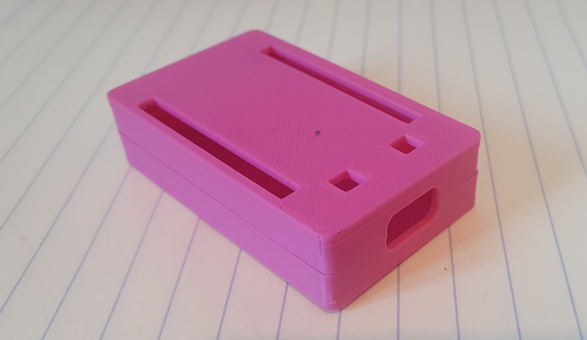

# ESP-32 development board case

This is a small friction fit case for the ESP32 microcontroller development board [ESP32-WROVER](https://www.digikey.com.au/en/products/detail/espressif-systems/ESP32-DEVKITS-R/11613124).

The headers need to be soldered pointing up (the reverse to how you would for breadboard) so that they are exposed on the same side as the buttons. The slots are the right size to accept jumper cables.

